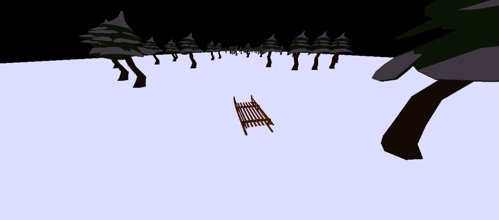

# Mini jeu THREE.js : Super Sledding

Dans ce jeu web 3D développé avec Three.js, dévalez une pente enneigée en luge en évitant de vous prendre les arbres ! 

Développé à partir du template [three_vite](https://github.com/fdoganis/three_vite) de fdoganis.

## But du jeu
Simplement descendre en toute liberté la pente en déplaçant la luge sur l'axe gauche-droite pour esquiver les arbres (les collisions entraînant une perte de contrôle grâce à une physique extrêmement réaliste)

## Commandes
- Touche <b>Q</b> du clavier : déplacer la luge vers la gauche
- Touche <b>D</b> du clavier : déplacer la luge vers la droite

## Installation

Install [Node.js](https://nodejs.org)

- Clone or download repo
- run `npm install` : fetches and install all dependencies
- `npm run build` : packages all code and resources into the `dist` folder
- `npm run dev` : launches a server and opens your browser in `https://localhost:5173` by default
- Edit your code : your changes are reflected instantly!

